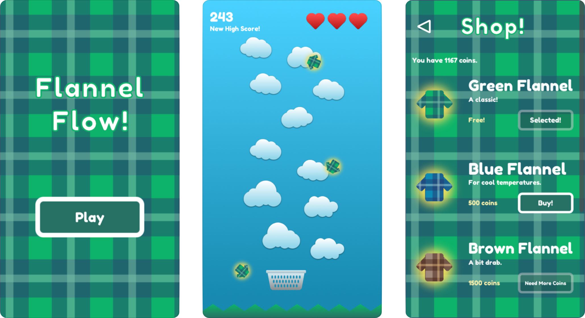

# Flannel Flow

Flannel flow is a simple game in which a player catches falling flannels,
built in Unity, currently available for iOS.

## Description

In Flannel Flow, you catch falling flannels! It starts out slow, but gets
faster as you go. Try to last as long as you can without losing your lives, and
use powerups to stay alive longer! Earn a coin for each point you score in the
game. You can buy new Flannels and compete with friends on the leaderboard,
too! Good luck!

## iOS Screenshots

## Installation

Flannel Flow is available to run as a simple unity project. The initial scene
is the `start` scene, available in
[`Assets/scenes/start.unity`](./Assets/scenes/start.unity).
